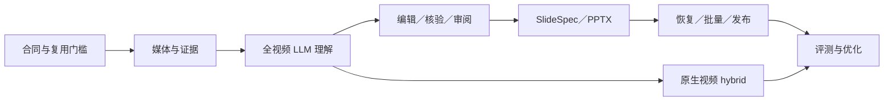

# yt2class 完整实施计划

> 实施时按任务使用测试驱动开发；在每个里程碑结束时做真实产物和证据审阅。

**目标：** 实现完整的 Video → KnowledgeDocument → SlideSpec → PPTX 流程，
让 LLM 覆盖整段课程、选择原始截图、生成有证据的讲义，并能从中断点安全恢复。

**架构：** Python 负责媒体、时间轴、合同、LLM 编排、证据核验与作业状态；
可替换 provider adapter 接收帧、音频或原生视频；Node/PptxGenJS 只渲染已绑定的
SlideSpec 3.0。所有阶段通过有版本 JSON 连接并以输入 hash 缓存。

**技术栈：** Python 3.11+、uv、Pydantic、Typer、yt-dlp、FFmpeg/ffprobe、
PySceneDetect、Pillow/OpenCV、可选 OCR、可选 WhisperX、HTTP provider adapters、
Node ESM、PptxGenJS、pytest。

本计划与[完整设计](2026-08-11-youtube-to-ppt-design.md)配套。
PR #15 的 ～につき 讲义质量补强另见[专项设计](2026-09-24-pr15-lesson-quality-design.md)和[逐任务开发计划](../superpowers/plans/2026-09-24-pr15-lesson-quality.md)。
文件名是目标布局；实施时可以保留兼容 facade，但不能让原型的 v1/v2 合同限制 3.0。
每个任务遵循：写行为测试→确认失败原因→最小实现→目标测试→相关测试→提交。
真实模型、YouTube 与视觉检查分别记录，不用单测代替。

## 1. 里程碑和依赖



| 里程碑 | 可以演示的结果 | 退出条件 |
| --- | --- | --- |
| M0 合同 | 合成 evidence→SlideSpec 校验 | 3.0 schemas/fixtures 跨模块一致；复用决策有实测 |
| M1 证据 | 本地/YouTube→统一 transcript＋visual catalogue | 时间轴和 hash 可追溯；缺失/失败状态清楚 |
| M2 LLM | 一部完整本地课程→CourseMap＋KnowledgeDocument | 核心时间窗口 100% 完成或有原因；可补证据 |
| M3 讲义计划 | KnowledgeDocument→核验过的 EditorialPlan | 严格模式无未解决关键 claim；可人工改 |
| M4 交付 | SlideSpec 3.0→PPTX＋sources＋预览 | 内容、图片、notes、links、布局全部验证 |
| M5 产品 MVP | build/batch/resume/doctor | 中断与缓存测试通过；YouTube/ASR 实跑通过 |
| M6 hybrid | 动态片段由原生视频模型辅助 | 时间映射和隐私状态可审计；frame fallback 可用 |
| M7 质量 | 标注集对照报告 | 达到设计门槛或公开记录差距 |

MVP 定义为 M0–M5。M6 是质量增强，不阻塞 frames 路线 MVP；
但 frames 路线遇到无法支持的动态过程必须标记不足。

## 2. 目标代码边界

```text
src/yt2class/
  domain/
    source.py transcript.py visual.py course_map.py knowledge.py
    editorial.py verification.py slide_spec_v3.py run_manifest.py
  adapters/
    ytdlp.py ffmpeg.py subtitles.py asr.py ocr.py
    providers/base.py providers/openai_vision.py providers/native_video.py
    render/pptxgenjs.py render/preview.py
  stages/
    ingest.py extract_evidence.py outline.py analyze_segments.py
    reduce_knowledge.py edit_deck.py verify_claims.py bind_spec.py render.py
  orchestration/
    scheduler.py cache.py workspace.py pipeline.py batch.py
  prompts/ outline.md segment.md editor.md verifier.md
  templates/ review.html
  workers/ whisperx_worker.py
  cli.py
renderer/
  package.json pnpm-lock.yaml src/render.mjs src/layouts/*.mjs
schemas/
  *.schema.json
tests/
  unit/ contract/ integration/ fixtures/ live/
```

domain 不导入 subprocess/httpx/PptxGenJS；adapter 不决定教学内容；
stage 不自行找隐式全局文件；orchestration 负责状态、预算、并发和取消。
provider 返回结构化结果和 usage，不返回本地资产路径。
旧模块在迁移期调用新接口，完成兼容测试后再删除，不一次性重写。

## 3. Task 0：复用实验与合同基线

### 0.1 summarize 兼容性实验

**未来文件：** `src/yt2class/adapters/summarize_cli.py`、
`tests/contract/test_summarize_cli.py`、固定上游输出 fixtures。

1. 记录上游 commit/version、许可证、安装和 Node 要求。
2. 对同一本地视频和一个 YouTube 样本运行 slide/extract JSON 路线；
   保存脱敏输出结构、时间戳、帧文件、字幕来源、退出码和失败恢复。
3. 写合同测试验证：全部时间合法、帧字节可读、来源可区分、错误不会伪装成功。
4. 与原生 yt-dlp/FFmpeg 小实现比较下载次数、结果稳定性、清理和耗时。
5. 形成采用结论：合格则做可选 ingestion backend；不合格则记录具体能力缺口。

**验证：** fixture 合同测试无需网络；live test 有显式标记且不进入普通单测。
**完成条件：** 不是根据 README 或 stars 作出集成决定。

### 0.2 定义 3.0 合同和跨字段校验

**未来文件：** `src/yt2class/domain/*.py`、`schemas/*.schema.json`、
`tests/contract/test_domain_contracts.py`、`tests/fixtures/contracts/`。

1. 先为 SourceManifest、TranscriptDocument、VisualCatalogue、SegmentManifest、
   CourseMap、KnowledgeDocument、EditorialPlan、VerificationReport、SlideSpec、
   RunManifest、RenderReport 写最小合法和逐项非法 fixture。
2. 实现 strict Pydantic union：额外字段拒绝、有限数字、半开区间、唯一 ID。
3. 实现文档间 resolver，检查 source、asset、evidence、claim、page 引用闭包。
4. 生成 Draft 2020-12 schemas；测试 schema 与模型同步。
5. 加入 v2→3.0 显式迁移报告：缺失 claim 引用的旧文字只能 unresolved/evidence-only。

**命令：** `uv run pytest tests/contract -q`。
**完成条件：** Python 和 JSON Schema 各自能力边界写入错误信息；
合成 SlideSpec 3.0 通过，路径/hash 校验由 binder 测试覆盖。

### 0.3 建立 provider 和 renderer 抽象合同

**未来文件：** `src/yt2class/adapters/providers/base.py`、
`src/yt2class/adapters/render/base.py`、`tests/contract/test_adapters.py`。

定义 ProviderCapabilities、ModelRequest、ModelResult、Usage、
EvidenceRequest、RenderRequest/Report。测试不支持模态、上下文超限、
结构化输出缺失、取消、超时、usage 缺失和幂等 request ID。
adapter 能力来自配置/探测；stage 只读取合同。

**M0 Gate：** 合同测试全部通过；summarize 采用结论明确；没有真实课程内容写死。

## 4. Task 1：来源、工作区与时间轴

### 1.1 SourceInput 与安全工作区

**未来文件：** `src/yt2class/domain/source.py`、
`src/yt2class/orchestration/workspace.py`、`src/yt2class/stages/ingest.py`、
`tests/unit/test_source.py`。

覆盖 YouTube、本地 MP4/MKV/WebM/MOV 和批量清单。
测试相同内容不同路径、文件变化、URL 参数、播放列表拒绝、空文件、
文件名空格/Unicode、run root symlink 和并发写锁。
本地 copy/reference 模式行为写入 SourceManifest；绝不改原文件。

### 1.2 yt-dlp、FFmpeg 与 ffprobe adapters

**未来文件：** `src/yt2class/adapters/ytdlp.py`、
`src/yt2class/adapters/ffmpeg.py`、
`tests/unit/test_media_adapters.py`、小媒体 fixtures。

命令使用参数数组、超时、取消和临时路径；捕获真实 yt-dlp 输出文件名。
ffprobe 校验 duration、streams、rotation、fps/timebase。
任何代理/转码记录 parent hash、命令摘要和时间映射。
测试部分下载、容器变化、无视频流、VFR、旋转素材和工具缺失。

### 1.3 时间映射属性测试

**未来文件：** `src/yt2class/domain/timebase.py`、`tests/unit/test_timebase.py`。

用属性测试覆盖 clip offset、嵌套 clip、VFR decoded PTS、边界 0/duration、
舍入和 YouTube seek 秒。禁止模型近似时间直接成为帧时间。
每一个最终 occurrence 可以逆向到原 source timestamp。

**M1a Gate：** 本地和 YouTube（live）生成同构 SourceManifest；
媒体失败不产生 complete manifest。

## 5. Task 2：字幕、ASR 与视觉证据

### 2.1 字幕轨选择和规范化

**未来文件：** `src/yt2class/adapters/subtitles.py`、
`src/yt2class/domain/transcript.py`、
`tests/unit/test_transcript.py`。

先测 sidecar/人工/自动字幕优先级、滚动重复、真实重复、重叠语音、
语言、空洞、坏时间和 HTML tag。保留 raw artifact/hash；
规范化段落含 origin 和 quality_flags。计算语音覆盖和时间覆盖时注明分母。

### 2.2 ASR adapter 与 WhisperX worker

**未来文件：** `src/yt2class/adapters/asr.py`、
`src/yt2class/workers/whisperx_worker.py`、
`tests/contract/test_asr.py`。

统一句段输出；模型、语言、设备、alignment 与 diarization 均记录。
测试 chunk offset、静默、识别失败、未对齐词、CPU 路线和 worker 中断。
先实现轻量 adapter 合同，再接 WhisperX；大型依赖放可选 extra/独立环境。
用有许可的短音频做 CPU smoke，不要求普通 CI 下载模型。

### 2.3 场景、候选帧、OCR 与 occurrence

**未来文件：** `src/yt2class/domain/visual.py`、
`src/yt2class/adapters/scenes.py`、`src/yt2class/adapters/ocr.py`、
`src/yt2class/stages/extract_evidence.py`、
`tests/integration/test_visual_evidence.py`。

fixture 包含静态课件、转场、重复板书、小字更新、黑底板书、快速操作。
先测期望时间窗覆盖和 occurrence 保留；再实现 Content/Adaptive profile、
场景内部采样、长静态补帧、质量特征、局部聚类和按需 OCR。
OCR bbox/文本与 parent frame 绑定。所有不可用区域保留 coverage gap。

### 2.4 Evidence bundle 贯通测试

本地 3–5 分钟 fixture 同时生成 SourceManifest、TranscriptDocument、
VisualCatalogue 和 coverage。随机检查 decoded PTS、hash 和截图可读性；
重复运行字节/ID 稳定。字幕/帧其中一项失败时状态可解释。

**M1 Gate：** 每个时间范围都有 transcript、visual 或明确 gap；
不得按最终 PPT 页数提前裁剪 evidence。

## 6. Task 3：全视频 LLM 理解闭环

### 3.1 CourseMap outline

**未来文件：** `src/yt2class/stages/outline.py`、
`src/yt2class/domain/course_map.py`、`src/yt2class/prompts/outline.md`、
`tests/unit/test_outline.py`。

将完整 transcript 划分为有序块；每块输出 topic/goal/range/evidence IDs，
再用 reducer 合成依赖关系。测试长文本全部进入调度、开头/结尾主题、
无 transcript、冲突 topic、越界引用和 reducer 丢块。
CourseMap 的推测字段不能直接作为 source claim。

### 3.2 Segment scheduler 与请求预算

**未来文件：** `src/yt2class/orchestration/scheduler.py`、
`src/yt2class/domain/segment.py`、`tests/unit/test_scheduler.py`。

实现核心窗口无缝铺满、上下文 overlap、句末边界、图片/token/payload 预算。
测试 0 秒、短片、长视频、超长单句、无场景、多批图片和取消。
coverage ledger 区分 scheduled/running/complete/degraded/failed。
性质测试：核心区间并集恰好覆盖 [0,duration)，且无重复核心范围。

### 3.3 Frame multimodal analyst

**未来文件：** `src/yt2class/stages/analyze_segments.py`、
`src/yt2class/prompts/segment.md`、`tests/contract/test_segment_model.py`。

先用 fake provider 测请求含有序帧、字幕、OCR、CourseMap context 和 allowed IDs。
实现结构化 KnowledgeUnit 输出，拒绝未知 ID、裸图片路径、无来源事实、
只有单帧却声称动态先后、遗漏否定/单位的非法结果。
HTTP 成功但合同失败最多一次结构修复，失败写入 ledger。

### 3.4 有界补证据循环

**未来文件：** `src/yt2class/stages/evidence_refinement.py`、
`tests/integration/test_evidence_refinement.py`。

测试 unreadable_text、missing_step、audio_visual_conflict 请求。
scheduler 只接受源范围内、模态允许、预算内请求；提取邻近高清帧或 5–30 秒短片。
同 segment 最多两轮；新证据只重跑受影响分析。
预算耗尽或仍不足形成 unresolved，不无限递归。

### 3.5 Knowledge reduction 与跨段关系

**未来文件：** `src/yt2class/stages/reduce_knowledge.py`、
`tests/unit/test_knowledge_reducer.py`。

按证据、概念键和时间关系合并重复，不合并互相矛盾/否定的 claim。
连接 prerequisite、comparison、procedure steps，验证 procedure 顺序完整。
测试 overlap 重复、同词不同义、跨段步骤、recap 和来源冲突。

### 3.6 第一个真实模型纵向样本

用本地 5–10 分钟课程、人工字幕和标注关键点执行 frames 模式。
保存脱敏 provider/model/prompt/version、usage、coverage 和中间 JSON；
逐 claim 人工核对，问题写成 fixture/regression，不把模型响应直接提交为金标准。

**M2 Gate：** 完整核心区间完成或有缺口原因；能发现课程主题、例子和步骤；
所有 claim 有可解析 evidence；没有最终页数导致的预分析截断。

## 7. Task 4：全局编辑、核验与人工审阅

### 4.1 受页数约束的 EditorialPlan

**未来文件：** `src/yt2class/stages/edit_deck.py`、
`src/yt2class/domain/editorial.py`、`src/yt2class/prompts/editor.md`、
`tests/unit/test_editor.py`。

先做确定性候选/覆盖评分，再让 LLM 组织标题、顺序和解释。
测试 target/max pages、必要前提、代表例子、重复图、text-only、comparison、
sequence、chronological/teaching order 以及 omissions。
模型只能引用 KnowledgeDocument IDs 和 allowed frame IDs。

### 4.2 Claim verifier

**未来文件：** `src/yt2class/stages/verify_claims.py`、
`src/yt2class/domain/verification.py`、`src/yt2class/prompts/verifier.md`、
`tests/contract/test_verifier.py`。

逐条验证数字、否定、条件、专名、翻译、步骤与图文对应。
支持 supported/contradicted/insufficient；一次修复仍失败则从正式稿移除或待审。
测试 verifier 自身未知引用、矛盾证据和 generated-practice 标签。
关键断言抽样人工复核，模型互审不作为唯一通过依据。

### 4.3 Review bundle 与受控修改

**未来文件：** `src/yt2class/stages/review.py`、
`src/yt2class/templates/review.html`、
`tests/integration/test_review_roundtrip.py`。

生成离线 review.html/json，展示原图、claims、transcript、时间链接、遗漏主题。
审阅操作只允许改文案、选择 allowed asset、删除/锁定/排序；
校验 baseline hashes 和 revision，拒绝过期 review。
修改后只重跑受影响 verifier/binder/renderer。

**M3 Gate：** strict 输出无 unresolved 关键 claim；
draft/evidence-only 在页面和报告里可见标识，不能伪装 verified。

## 8. Task 5：SlideSpec 3.0、PPTX 与来源回链

### 5.1 Binder 和 SlideSpec 3.0

**未来文件：** `src/yt2class/stages/bind_spec.py`、
`src/yt2class/domain/slide_spec_v3.py`、
`schemas/slide-spec.v3.schema.json`、`tests/contract/test_slide_spec_v3.py`。

按设计实现 evidence/assets/claims/pages 联合类型。
测试 cover、image-text、text、comparison、sequence、summary、quiz，
引用闭包、页数、正式 verdict、路径 containment、symlink、hash/MIME、OCR bbox。
渲染器收到最终物理页；binder 不依赖渲染器偷偷增加 summary/quiz 页。

### 5.2 PptxGenJS 项目和布局

**未来文件：** `renderer/package.json`、lockfile、`renderer/src/*.mjs`、
`adapters/render/pptxgenjs.py`、`tests/integration/test_pptx_renderer.py`。

固定 PptxGenJS 版本；实现六类布局、主题、CJK 字体探测、contain 图片和 notes。
先写 PPTX package 测试：所有文本、图片 bytes、notes、hyperlink relationships
存在；再做每类布局 fixture。禁止 LLM 生成 JS/坐标。
测试超长标题、4 点正文、2/3 图、8 条总结、练习答案、缺字体和原子写失败。

### 5.3 来源索引与回链

**未来文件：** `src/yt2class/provenance.py`、`tests/unit/test_provenance.py`。

测试 YouTube URL 各形式、已有 query、0/小数/末尾时间；
生成规范 seek link 和精确 notes。比较/步骤页逐图引用，
summary/quiz 汇总 claim evidence。输出 sources.json 和 page map。
本地视频只显示文件名/时间/hash。

### 5.4 预览与视觉 QA

**未来文件：** `src/yt2class/adapters/render/preview.py`、
`src/yt2class/adapters/render/qa.py`、`tests/integration/test_visual_qa.py`。

通过配置的 LibreOffice/PDF/PNG 链路预览；检查页数、空白页、溢出、
重叠、图边界、最低字体和缺字信号，生成 contact sheet。
算法 QA 通过后仍对真实 CJK/PPT 样本人工逐页检查。
preview 不可用时状态 unavailable；strict 交付门槛按配置停止。

### 5.5 安装包验证

构建 wheel，在全新临时环境安装；从非源码目录调用 Python 和 Node renderer，
证明 renderer 资产和 module resolution 不依赖工作区/Codex runtime。
验证 PPT 能被 LibreOffice/PowerPoint 打开，并检查 PPTX ZIP 完整性。

**M4 Gate：** 审阅过的 EditorialPlan 产生可编辑 PPTX、sources、report、预览；
所有最终内容与图片可回溯且没有静默丢失。

## 9. Task 6：作业编排、缓存、CLI 和批量

### 6.1 Stage DAG、manifest 与原子缓存

**未来文件：** `src/yt2class/orchestration/cache.py`、
`src/yt2class/domain/run_manifest.py`、
`src/yt2class/orchestration/pipeline.py`、`tests/integration/test_resume.py`。

按设计 cache key；每阶段 partial→validate→atomic rename。
故障注入覆盖每个写入点、kill/restart、损坏 cache、旧 schema、
字幕/主题/模型/人工修订变化。检查只失效正确下游。
provider 不确定响应记录 request ID 和可能重复计费状态。

### 6.2 CLI 与 doctor

**未来文件：** `src/yt2class/cli.py`、`src/yt2class/config.py`、
`tests/integration/test_cli.py`。

实现 build/batch/ingest/analyze/plan/review/verify/render/resume/doctor。
测试互斥输入、配置覆盖、脱敏快照、退出码、预算暂停和 continue-on-error。
doctor 检查工具、codec、ASR、provider capabilities、字体、renderer/preview。
帮助文本只承诺已实现且测试的命令。

### 6.3 预算、重试、并发和取消

**未来文件：** `src/yt2class/orchestration/budget.py`、
`src/yt2class/orchestration/retry.py`、`tests/unit/test_runtime_policy.py`。

fake clock/provider 测 token/image/video/cost 预算、Retry-After、jitter、
401/429/5xx、无效 JSON、最大并发 2、Ctrl-C 和 worker 清理。
单个 batch 项失败不阻止其他项，最终报告和退出码保留部分失败。

### 6.4 MVP 端到端矩阵

执行并保存报告：

1. 本地视频＋人工字幕＋真实视觉 LLM；
2. 本地视频无字幕→ASR；
3. YouTube＋人工字幕；
4. YouTube 只有自动字幕；
5. provider 超时/预算耗尽→可恢复；
6. 无模型→evidence-only；
7. 人工 review→单页重渲染。

**M5 Gate：** 上述矩阵完成，严格输出满足 M4；重复运行复用正确阶段；
安装文档从干净环境可执行。

## 10. Task 7：原生视频与 hybrid

### 7.1 NativeVideoAdapter

**未来文件：** `src/yt2class/adapters/providers/native_video.py`、
`tests/contract/test_native_video.py`。

实现 upload/readiness/analyze/delete，映射 source clip range。
测试 MIME、时长、上传 hash、provider handle 脱敏、取消、删除失败、
远程保留状态、近似 timestamp 和 usage。
记录 provider 文档版本与能力探测结果。

### 7.2 Hybrid 路由

仅在 procedure、快速变化或 verifier 不足时升级 clip。
测试 frames 足够时不上传视频；动态片段只上传最小范围；
native 失败回 frames 并保持 unresolved；补证据预算有效。
同一 KnowledgeDocument 合并两种分析，不产生两套事实模型。

### 7.3 隐私和成本验收

review/config 明确显示媒体是否上传、范围、保留策略和预算。
用同一动态样本比较 frames/native/hybrid 的步骤完整性、成本和时长。
达到标注集收益才建议 hybrid 默认；否则保持 opt-in。

**M6 Gate：** 原生视频提供可测的动态理解增益，且时间、隐私、成本可审计。

## 11. Task 8：质量评测、文档和发布

### 8.1 标注集和对照实验

**未来文件：** `evals/manifest.yaml`、`evals/scoring.py`、
`tests/test_eval_contract.py`；原始媒体不提交，记录获取/授权方式。

建立五类至少 10 段及一部长课程；保存主题、claims、时间窗、可读帧、
否定/条件、步骤和不确定项。支持双人 adjudication。
运行等间隔、视觉去重、transcript-only、frames multimodal、hybrid 对照。
评分分开报告覆盖、事实错误、截图可读、布局、成本和墙钟时间。

### 8.2 性能和可恢复性测试

对 10/30/90 分钟视频测磁盘、峰值内存、阶段耗时、调用数与成本。
模拟下载中断、ASR kill、provider 429、分析半完成、审阅过期和渲染失败。
性能目标基于测量后写入，不预设无法证实的实时倍数。

### 8.3 用户文档与样例

README 只把 M5 已验收能力写入快速开始；完整设计保留目标说明。
提供无版权问题的小 fixture、示例 config、review 流程、provider 隐私提示、
产物目录、doctor 输出和故障恢复。不要提交真实用户视频、cookie 或密钥。

### 8.4 发布门槛

- 全部 unit/contract/integration 测试通过；
- live YouTube/provider 结果与运行日期明确；
- 至少一份完整 PPTX 逐页视觉验收；
- 安装 wheel 和 Node renderer 从干净目录工作；
- 许可证/SBOM/第三方依赖核对；
- 远端提交、tag、CI 对应同一 SHA；发布说明区分已实现和 roadmap。

**M7 Gate：** 指标达到完整设计门槛；未达到项作为量化限制，不用模糊措辞覆盖。

## 12. 提交建议

建议一任务一提交，里程碑用可运行垂直切片收束。提交例：

```text
docs: define v3 evidence contracts
feat: ingest source media with stable provenance
feat: build transcript and visual evidence catalogues
feat: analyze complete video timeline into knowledge units
feat: verify claims and export review bundle
feat: bind v3 slide specs and render pptx
feat: resume versioned pipeline stages
feat: add native video analysis adapter
test: add annotated video-to-ppt evaluation suite
```

每次提交前运行目标测试与受影响套件；M2/M4/M5/M6 额外保存真实产物验收记录。
只有文档改动时检查 Markdown 结构、链接、示例 JSON/YAML 语法和 diff；
不得把现有原型测试通过写成完整目标系统通过。
